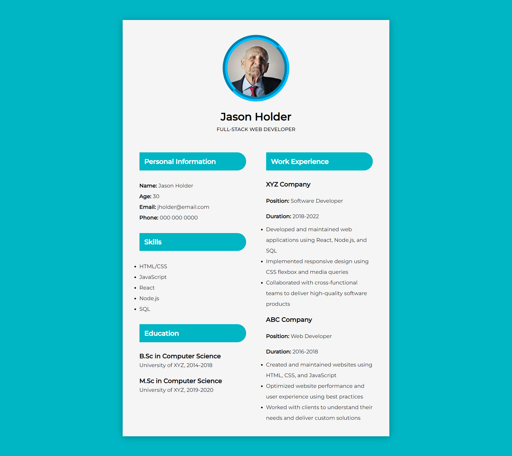

<h1 align="center">
  Online CV
</h1>

<h3 align="center">
  Template
</h3>

  

The Online CV Template is a comprehensive and visually appealing HTML and CSS template designed to help individuals create impressive and professional online CVs. This template offers a clean and modern interface, making it perfect for showcasing personal information, work experience, skills, and education in an organized and aesthetically pleasing manner.
  
With this template, users can easily present their personal information, such as their name, contact details, and a brief introduction or personal statement. The layout is thoughtfully designed, providing clear sections for work experience, skills, and education, allowing users to highlight their qualifications and achievements effectively.
  
The template's responsiveness ensures that the online CV adapts seamlessly to different screen sizes and devices. Whether viewed on a desktop computer, laptop, tablet, or smartphone, the CV will retain its readability and visual appeal, providing an optimal viewing experience for potential employers, recruiters, or anyone accessing the CV online.
  
The layout of the template is highly customizable, allowing users to tailor the design to their personal preferences. They can easily modify colors, fonts, and other stylistic elements to match their desired branding or aesthetic. The clean and well-structured codebase makes customization straightforward, even for those with limited coding experience.
  
One of the key strengths of this template is its focus on key sections of an effective CV. The work experience section allows users to detail their professional history, including job titles, company names, employment dates, and concise descriptions of responsibilities and accomplishments. The skills section provides an opportunity to highlight relevant skills, expertise, and proficiencies in a visually appealing format. The education section allows users to showcase their educational background, including degrees, certifications, and academic achievements.
  
This template's simplicity and user-friendly interface make it suitable for individuals from various professional backgrounds. Whether you're a seasoned professional, a recent graduate, or someone looking to showcase your skills and experience in a visually compelling manner, the Online CV Template provides an excellent foundation for creating a standout online CV.
  
Overall, the Online CV Template offers a comprehensive and customizable solution for individuals seeking to create an impressive online CV. With its responsive design, attention to key CV sections, and ease of customization, this template empowers users to present their professional credentials effectively and leave a lasting impression on potential employers or recruiters.

  
<!-- ................................................................................................................................. -->

### Resources
 
Follwing resources have been used in maintaining this project:

- [Pexels](https://www.pexels.com/) for importing the Profile Picture of the user.

  
<!-- ................................................................................................................................. -->

### Demo

  The Demo of this working project can be found on  
  <a href="https://rebrand.ly/OnlineCV_MABCORP">rebrand.ly/OnlineCV_MABCORP</a>

  
<!-- ................................................................................................................................. -->

### Template's Interface  

  
<!-- ................................................................................................................................. -->

### Technology Stack
 
Follwing technologies have been used at the core of this application to make it stand in the market place:

- HTML
- CSS

  
<!-- ................................................................................................................................. -->

### Advancement

> Nothing Recommended Yet

  
<!-- ................................................................................................................................. -->

### Deployment Details

The website is deployed using the free hosting provided by **Vercel**

  

  
Later on the link was customized using the well-known URL shortener and customizer **Rebrandly**:  

  

  
<!-- ................................................................................................................................. -->

### Developer

Muhammad Abdullah Butt  
abdullahbutt12292210@gmail.com  
> [Instagram](https://www.instagram.com/abdullah.butt.22/) 
> [FaceBook](https://www.facebook.com/profile.php?id=100076291614529) 
> [YouTube](https://www.youtube.com/channel/UCnuOFQyMywg-KuoN-lmav1Q) 
> [Portfolio](https://rebrand.ly/MuhammadAbdullahButt_MABCORP) 
> [Project Displayer]( https://rebrand.ly/ProjectDisplayer_MABCORP)
  
<!-- ................................................................................................................................. -->

